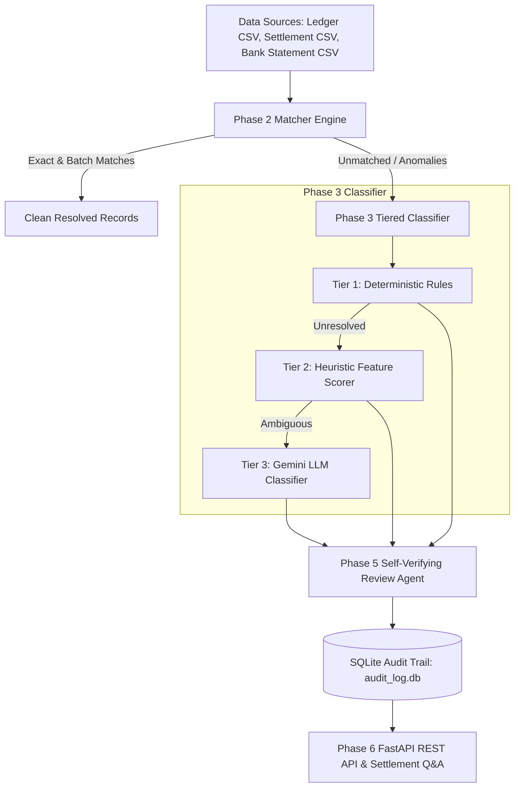

# AI Finance Controller — Multi-Source Reconciliation Agent

[](https://www.python.org/)
[](https://fastapi.tiangolo.com/)
[](https://www.sqlite.org/)
[](https://ai.google.dev/)
[]()

> **Razorpay AI Internship Challenge — Track 4 (AI Finance Controller)**  
> An autonomous, multi-source financial reconciliation agent that reconciles internal merchant ledger entries against Razorpay settlement reports and bank statement feeds, classifies complex financial anomalies using a tiered architecture, and self-verifies decisions through an adversarial review agent.

---

## 📌 Executive Summary

Modern payment reconciliation across gateways, merchant ledgers, and bank statements suffers from messy UTR narrations, batch settlement aggregations, timing lags, refund pairs, and gateway fee deductions.

This repository implements an autonomous, end-to-end reconciliation system featuring:
* **Integer-Paise Precision Engine**: Eliminates floating-point rounding drift by computing all monetary values strictly as integer paise ($1\text{ INR} = 100\text{ paise}$).
* **3-Tiered Exception Classifier**: Combines deterministic rules, heuristic weighted feature scoring, and Gemini LLM integration to resolve complex financial edge cases.
* **Self-Verifying Adversarial Review Agent**: A Phase 5 verification layer that acts as a second-tier auditor, catching and correcting initial classification oversights prior to final resolution.
* **Full Auditability**: Every pipeline decision logs to an append-only SQLite database across 5 distinct pipeline stages (`ingest`, `match`, `classify`, `verify`, `rule_promotion`).
* **Interactive Q&A API**: FastAPI endpoints enabling structured status queries and natural-language settlement Q&A grounded strictly in audit trail evidence.

---

## 🎯 Benchmark Evaluation & Results

Evaluated against a 62-record dataset comprising real captured Razorpay payment templates and 10 categories of synthetic planted edge cases:

* **Overall Accuracy Score**: **`100.00% (62/62)`** under strict, non-permissive evaluation rules.
* **False Positive Rate**: **`0.00%`** (0 clean records falsely flagged as exceptions).
* **Human Review Escalation Rate**: **`0.00%`** across standard execution runs.

### Performance Breakdown by Category

| Category | Description | True Positives | False Positives | False Negatives |
| :--- | :--- | :---: | :---: | :---: |
| `clean_match` | Exact 1:1 settlement & bank credit | **35** | 0 | 0 |
| `batch_aggregation` | Multi-order aggregated settlement payout | **10** | 0 | 0 |
| `normal_lag` | Settlement delayed by 1–3 business days | **5** | 0 | 0 |
| `garbled_utr` | Truncated/garbled bank UTR string | **3** | 0 | 0 |
| `missing_bank_credit` | Settlement generated but absent from bank statement | **2** | 0 | 0 |
| `refund_pair` | Original payment offset by matching refund | **2** | 0 | 0 |
| `rounding_noise` | Fee calculation variance ($\le 2$ paise) | **2** | 0 | 0 |
| `duplicate_settlement` | Double-payout of single order ID | **1** | 0 | 0 |
| `orphan_ledger_entry` | Merchant ledger record with no matching gateway payload | **1** | 0 | 0 |
| `unexplained_bank_amount_discrepancy` | UTR fuzzy match with unexplained fee discrepancy | **1** | 0 | 0 |

### 💡 Concrete Highlight Case: `ORD-1061`
Record `ORD-1061` represents a complex planted exception featuring both a garbled bank UTR narration (`NEFT-RZP2026080157XUNEXP-RAZORPAY`) and an unexplained ₹43.21 net amount discrepancy (-4,321 paise).
1. **Tier 3 Classifier**: Initially classified the record as `reference_formatting_issue` based on the fuzzy UTR match score.
2. **Phase 5 Verifier Agent**: Evaluated the evidence payload, recognized that the ₹43.21 amount discrepancy exceeded formatting noise, and automatically corrected the classification to **`amount_mismatch`** with `0.95` confidence:
   > *"While a fuzzy UTR match occurred, the significant amount discrepancy of 43.21 rupees (-4321 paise) makes amount_mismatch the more critical and accurate primary classification."*

---

## 🏗️ System Architecture



1. **Phase 1: Ingestion & Generator**: Loads real Razorpay payment objects (`real_samples/`) and generates realistic 3-way financial feeds.
2. **Phase 2: Reconciliation Matcher**: Executes exact UTR joins, gross/net fee deductions, batch settlement aggregation, and date window matching.
3. **Phase 3: Tiered Classifier**:
   - *Tier 1*: Fast deterministic rules (duplicate payouts, date lag, exact UTR formatting).
   - *Tier 2*: Heuristic scoring across date delta, net amount variance, and UTR string similarity.
   - *Tier 3*: Gemini Flash LLM integration (`gemini-3.5-flash-lite`) for complex edge case reasoning.
4. **Phase 4: SQLite Audit Engine**: Writes structured JSON audit events (`ingest`, `match`, `classify`, `verify`, `rule_promotion`) to `data/audit_log.db`.
5. **Phase 5: Self-Verifying Review Agent**: Independent auditor evaluating initial classifications to prevent false positives and correct category misallocations.
6. **Phase 6: API & Settlement Q&A**: FastAPI server exposing verified REST endpoints (`/reconcile/run`, `/results`, `/exceptions`, `/audit/{record_id}`, `/ask`).

---

## 🛠️ Installation & Setup

### Prerequisites
* Python 3.10 or higher
* Google Gemini API Key (Free Tier from [Google AI Studio](https://aistudio.google.com/))

### 1. Clone & Setup Virtual Environment
```bash
git clone https://github.com/Poorvanshi1375/razorpay_recon_agent.git
cd razorpay_recon_agent
python -m venv venv
# On Windows:
venv\Scripts\activate
# On Linux/macOS:
source venv/bin/activate
```

### 2. Install Dependencies
```bash
pip install -r requirements.txt
```

### 3. Environment Configuration
Create a `.env` file in the root directory (based on `.env.example`):
```ini
GEMINI_API_KEY=your_free_tier_gemini_api_key_here
```

---

## 🚀 Running the Pipeline

### 1. Generate Reconciliation Datasets
```bash
python data/generator.py
```

### 2. Run Full Reconciliation & Ground Truth Evaluation
```bash
python eval/score_against_ground_truth.py
```

### 3. Launch FastAPI Development Server
```bash
uvicorn api.main:app --reload --port 8000
```
* **Interactive OpenAPI Docs**: Navigate to [http://127.0.0.1:8000/docs](http://127.0.0.1:8000/docs)

#### **API Endpoint Reference**

| Method | Endpoint | Description |
| :--- | :--- | :--- |
| `GET` | `/` | Health check & route index |
| `POST` | `/reconcile/run` | Execute full multi-source reconciliation pipeline |
| `GET` | `/results` | Fetch clean matched settlement records |
| `GET` | `/exceptions` | Fetch categorized and verified exception records |
| `GET` | `/audit/{record_id}` | Fetch append-only audit trail logs for a record |
| `POST` | `/ask` | Settlement Q&A grounded in SQLite audit evidence |

* **Sample Settlement Q&A Request**:
```bash
curl -X POST "http://127.0.0.1:8000/ask" \
     -H "Content-Type: application/json" \
     -d '{"question": "Why did ORD-1061 fail clean reconciliation?"}'
```


### 4. Launch Next.js Web Dashboard

The repository includes a modern web dashboard built with Next.js (App Router), TailwindCSS, and Lucide icons.

#### Key Dashboard Pages
* **Overview (`/`)**: Real-time KPI summary cards (Total Records, Clean Matches, Verified Exceptions, Review Flags) and exception breakdown.
* **Exceptions Queue (`/exceptions`)**: Filterable exception queue displaying initial vs verified categories, confidence scores, and verifier agreement badges (`AGREED` / `CORRECTED`).
* **Audit Trail Drilldown (`/exceptions/[recordId]`)**: Complete 4-stage audit history (`ingest`, `match`, `classify`, `verify`), evidence payloads, and verifier reasoning for specific records (e.g., `ORD-1061`).
* **Settlement Q&A (`/ask`)**: Natural-language chat interface for asking settlement questions grounded directly in SQLite audit evidence.

#### Running the Dashboard

```bash
cd dashboard
npm install

# Option A: Development Mode
npm run dev

# Option B: Production Build (Recommended)
npm run build
npm run start
```
Access the dashboard at [http://localhost:3000](http://localhost:3000) (ensuring the FastAPI backend is running on `http://127.0.0.1:8000`).

### 5. Run Unit Test Suite
```bash
python -m pytest
```

---

## 📄 Retrospective & Failure Analysis

For a detailed chronological log of real engineering challenges, failure cases, Gemini model deprecations, quota management, and fixes encountered during development, see [`docs/what_broke.md`](file:///c:/Users/Admin/OneDrive/Desktop/razorpay/docs/what_broke.md).

---

## 🔒 Free-Tier & Policy Compliance

* **100% Free Tools Only**: Uses SQLite for local audit logging and Google Gemini's free-tier API (`gemini-3.5-flash-lite`). Zero paid cloud databases, subscriptions, or third-party APIs were used.
* **Ground Truth Honesty**: `data/ground_truth.json` is strictly read-only and is exclusively accessed by `eval/score_against_ground_truth.py`. No matcher, classifier, or verifier code references ground truth.
* **Paise Precision**: All calculations enforce integer-only math to prevent floating-point bugs.
